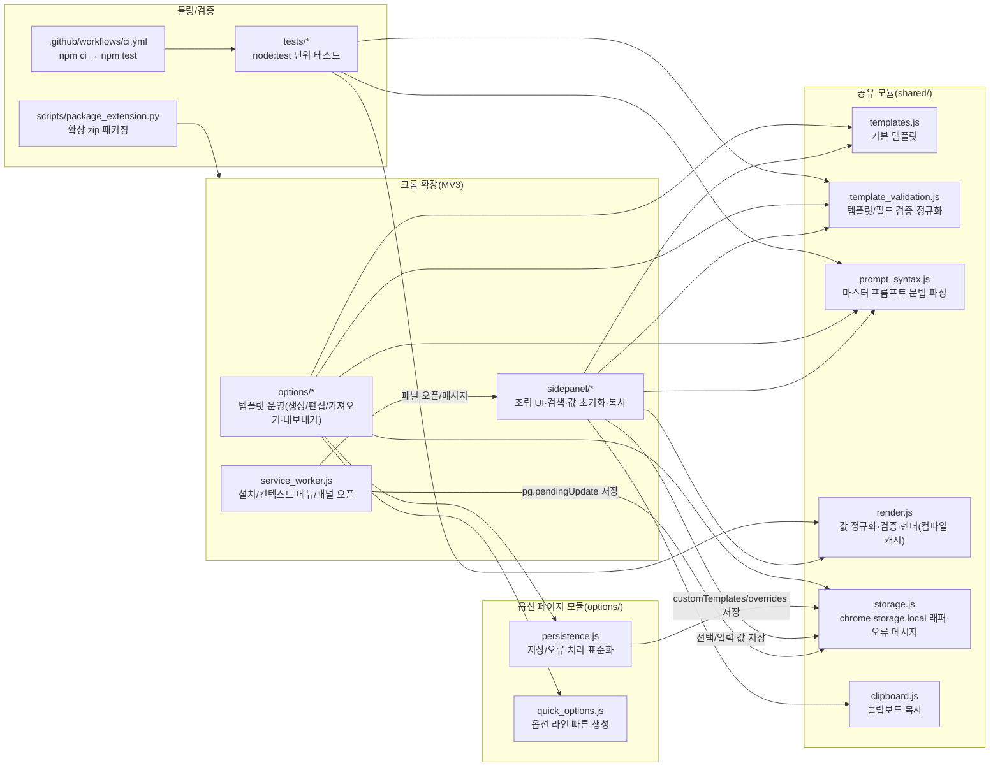

# 📊 프로젝트 종합 평가 보고서

> 이 문서는 Vibe Coding Report VS Code 확장에서 자동으로 관리됩니다.

---

<!-- AUTO-OVERVIEW-START -->
## 📋 프로젝트 개요

### 🎯 목표 및 비전

- **프로젝트 목적:** 버튼/입력 폼 기반 UI로 “마스터 프롬프트(템플릿)”를 빠르게 조립·검증하고, 즉시 복사 가능한 결과를 제공해 프롬프트 작성 시간을 단축합니다.
- **핵심 목표:** (1) 입력 즉시 미리보기/검증 (2) 단일 동작/단축키로 복사 (3) 선택값 저장/복원 (4) 템플릿 운영(생성/편집/가져오기·내보내기/필드 자동 생성) (5) 선택 텍스트 주입 기반의 빠른 워크플로.
- **대상 사용자:** 프롬프트를 반복 작성하는 크리에이터/디자이너/기획자/개발자 등(특히 템플릿 기반으로 문구를 재사용·운영하려는 사용자).
- **주요 사용 시나리오:** 템플릿 선택 → 옵션 검색/선택·텍스트 입력 → 즉시 미리보기/검증 → 복사 → 외부 도구(모델/웹앱)에 붙여넣기 → 필요 시 옵션 페이지에서 템플릿 수정/추가·가져오기·내보내기.
- **생태계 내 포지셔닝:** 계정/서버 없이 동작하는 “브라우저 로컬 퍼스트” 프롬프트 빌더로서, 크롬 사이드 패널 UX(즉시 입력/복사)와 템플릿 운영 기능을 결합해 확장 가능한 프롬프트 관리 기반을 제공합니다.

### 🧭 프로젝트 메타데이터

| 항목 | 값 |
|------|-----|
| **프로젝트명** | promtmanager |
| **버전** | 0.1.3 (`promptgen-extension/manifest.json` 기준) |
| **최초 분석일** | 2025-12-24 13:39 |
| **최근 분석일** | 2025-12-24 20:31 |
| **파일 수** | 35 (`.git/node_modules/dist/build/.vscode` 제외) |
| **디렉토리 수** | 10 (동일 기준) |
| **주요 언어** | JavaScript / HTML / CSS / Markdown / Python |
| **플랫폼/형태** | 크롬 확장(Manifest V3, 사이드 패널 + 옵션 페이지) + Node 단위 테스트 + GitHub Actions CI + Python 패키징 |

### 🧩 기능 기반 패키지(모듈) 다이어그램

- **핵심 사용자 흐름:** 템플릿 선택 → 옵션 검색/선택·텍스트 입력 → 즉시 미리보기/검증 → 버튼/단축키 복사 → 선택값 자동 저장/복원
- **템플릿 운영 흐름:** 옵션 페이지에서 템플릿 생성/편집/가져오기·내보내기·필드 자동 생성 → 저장 → 사이드 패널에서 즉시 반영
- **선택 텍스트 주입 흐름:** 컨텍스트 메뉴 → `pg.pendingUpdate` 저장 → 사이드 패널이 읽어 ASSET(또는 지정 필드)에 반영
- **품질 게이트:** GitHub Actions에서 PR/푸시 시 `npm test`를 자동 실행하여 회귀를 조기 탐지
<!-- AUTO-OVERVIEW-END -->

---

<!-- AUTO-STRUCTURE-START -->
## 📐 프로젝트 구조

### 📐 기능 기반 프로젝트 구조

**프로젝트**: `promtmanager`
**타입**: 📦 일반 프로젝트

| 기능 영역 | 설명 | 파일 수 |
|:---|:---|:---:|

#### 주요 진입점
- _(엔트리포인트 자동 감지 실패)_

<!-- AUTO-STRUCTURE-END -->

---

<!-- AUTO-SCORE-START -->
## 📊 종합 점수 요약

### 🧾 점수 ↔ 등급 기준(고정)

| 점수 범위 | 등급 | 색상 | 의미 |
|:---:|:---:|:---:|:---:|
| 97–100 | A+ | 🟢 | 최우수 |
| 93–96 | A | 🟢 | 우수 |
| 90–92 | A- | 🟢 | 우수 |
| 87–89 | B+ | 🔵 | 양호 |
| 83–86 | B | 🔵 | 양호 |
| 80–82 | B- | 🔵 | 양호 |
| 77–79 | C+ | 🟡 | 보통 |
| 73–76 | C | 🟡 | 보통 |
| 70–72 | C- | 🟡 | 보통 |
| 67–69 | D+ | 🟠 | 미흡 |
| 63–66 | D | 🟠 | 미흡 |
| 60–62 | D- | 🟠 | 미흡 |
| 0–59 | F | 🔴 | 부족 |

### 📌 종합 점수

| 항목 | 점수 (100점 만점) | 등급 | 변화 |
|------|------------------|------|------|
| **코드 품질** | 88 | 🔵 B+ | — (이번 평가) |
| **아키텍처 설계** | 88 | 🔵 B+ | — (이번 평가) |
| **보안** | 90 | 🟢 A- | — (이번 평가) |
| **성능** | 89 | 🔵 B+ | — (이번 평가) |
| **테스트 커버리지** | 82 | 🔵 B- | — (이번 평가) |
| **에러 처리** | 86 | 🔵 B | — (이번 평가) |
| **문서화** | 90 | 🟢 A- | — (이번 평가) |
| **확장성** | 87 | 🔵 B+ | — (이번 평가) |
| **유지보수성** | 85 | 🔵 B | — (이번 평가) |
| **프로덕션 준비도** | 86 | 🔵 B | — (이번 평가) |
| **총점 평균** | **87** | **🔵 B+** | — |

### 🧠 산정 근거(요약)

- **코드 품질(88/B+):** `shared/*`에 핵심 로직(렌더/검증/문법/저장/복사)이 집중되어 있고, 옵션/패널에서 이를 재사용합니다. 다만 UI 엔트리 파일이 커져(600~700라인) 변경 단위가 커지는 구간이 있습니다(`opt-sidepanel-modularize-001`, `opt-options-modularize-001`).
- **아키텍처 설계(88/B+):** MV3(서비스 워커/사이드 패널/옵션 페이지) 책임 경계가 명확하며, “템플릿 운영(옵션) → 즉시 사용(패널)” 흐름이 깔끔하게 연결됩니다.
- **보안(90/A-):** 외부 네트워크 호출이 없고 권한이 제한적(스토리지/사이드패널/컨텍스트 메뉴)이며, DOM 반영이 주로 `textContent` 기반으로 안전합니다.
- **성능(89/B+):** `render.js`에 템플릿 컴파일/캐시가 있어(라인별 토큰 매핑) 입력 이벤트 반복 처리 비용을 줄였습니다. 대규모 템플릿 환경에서도 구조적으로 확장 가능한 방향입니다.
- **테스트 커버리지(82/B-):** `node --test`로 파서/렌더/검증 핵심에 대한 회귀 테스트가 존재합니다(`tests/*`). 다만 브라우저 UI 로직(옵션/패널)의 자동 테스트는 제한적입니다.
- **에러 처리(86/B):** 스토리지 실패를 사용자 메시지로 표준화(`storageErrorToUserMessage`)했고, 사이드 패널의 자동 저장 실패도 상태 영역에 노출합니다. 다만 “템플릿 마스터/필드 불일치” 같은 운영 실수에 대한 사전 경고는 강화 여지가 있습니다(`validation-master-field-consistency-001`).
- **문서화(90/A-):** README에 데이터 모델/렌더링 규칙/운영·트러블슈팅이 구조적으로 정리되어 온보딩 비용이 낮습니다.
- **확장성(87/B+):** 커스텀 템플릿·오버라이드·가져오기/내보내기·필드 자동 생성·템플릿 검색/값 초기화까지 제공되어 템플릿 규모 증가에 대응합니다.
- **유지보수성(85/B):** 공유 모듈 분리는 우수하나, UI 엔트리(`sidepanel.js`, `options.js`)가 커져 변경 시 회귀 위험이 증가합니다(모듈화 권장: `opt-sidepanel-modularize-001`, `opt-options-modularize-001`).
- **프로덕션 준비도(86/B):** GitHub Actions에서 `npm ci → npm test`로 품질 게이트가 구축되어 있습니다. 다만 패키징(`npm run package:ext`)까지 CI에서 확인하면 배포 안정성이 더 높아집니다(`tooling-ci-package-001`).
<!-- AUTO-SCORE-END -->

---

<!-- AUTO-DETAIL-START -->
## 🔍 기능별 상세 평가

### 1) MV3 서비스 워커 (`promptgen-extension/service_worker.js`)

- **기능 완성도:** 설치 시 패널 동작 설정, 컨텍스트 메뉴 생성, 선택 텍스트를 `pg.pendingUpdate`로 저장, 사이드 패널 오픈 및 메시지 전송까지 “선택 텍스트 주입” 흐름이 완성되어 있습니다.
- **코드 품질:** 환경별 실패 가능성을 고려한 try/catch 및 베스트에포트(실패해도 사용자 흐름 유지) 전략이 일관됩니다.
- **에러 처리:** 실패 시 콘솔 경고로 진단 가능하며, 핵심 기능(패널/옵션) 동작을 강제로 중단하지 않습니다.
- **성능:** 이벤트 기반이며 호출 빈도가 낮아 부담이 제한적입니다.
- **강점:** 패널이 닫혀 있어도 주입 데이터를 저장해두고, 패널이 열릴 때 반영할 수 있는 구조입니다.
- **약점 / 리스크:** `pendingUpdate` 저장 실패(정책/쿼터) 시 사용자에게 직접 안내하기 어렵습니다(서비스 워커 특성). 실패 시 패널 측에서 상태 메시지로 보완하는 전략이 필요합니다.

### 2) 사이드 패널 UI (`promptgen-extension/sidepanel/*`)

- **기능 완성도:** 템플릿 선택/검색, 필드 UI(텍스트·단일·다중), 미리보기/검증 오류 표시, 복사(단축키 포함), “값 초기화”까지 실사용 흐름이 탄탄합니다.
- **코드 품질:** `normalizeValues`/`renderPrompt` 재사용, 템플릿/값 로드→UI 생성→미리보기 갱신 흐름이 명확합니다. 다만 단일 파일이 700라인 수준으로 커져 책임 분리 여지가 큽니다(`opt-sidepanel-modularize-001`).
- **에러 처리:** 스토리지 저장 실패를 사용자 메시지로 노출하고(상태 영역), 템플릿 불러오기/검증 실패는 경고 영역으로 안내합니다. 복사 실패 시 수동 복사 동선도 제공됩니다.
- **성능:** `render.js`의 컴파일/캐시 덕분에 대형 템플릿에서도 반복 렌더 비용을 구조적으로 완화했습니다. UI 이벤트 처리 또한 경량입니다.
- **강점:** “템플릿 운영(옵션) ↔ 즉시 사용(패널)”의 연결이 자연스럽고, 검색/초기화로 템플릿 규모 증가에도 대응합니다.
- **약점 / 리스크:** UI 로직이 단일 파일에 집중되어 변경 시 회귀 위험이 커질 수 있습니다(모듈화/테스트 가능 단위 분리 권장).

### 3) 옵션 페이지(템플릿 관리) (`promptgen-extension/options/*`)

- **기능 완성도:** 템플릿 생성/복제/삭제, 기본 템플릿 오버라이드, 필드 JSON 편집, 마스터 기반 필드 자동 생성, 가져오기/내보내기까지 “템플릿 운영” 기능이 충실합니다.
- **코드 품질:** `persistence.js`, `quick_options.js`로 일부 책임이 분리되어 있으며, 검증/정규화 모듈을 일관되게 사용합니다. 다만 메인 파일(`options.js`)이 여전히 크므로 추가 모듈화 여지가 있습니다(`opt-options-modularize-001`).
- **에러 처리:** 저장 실패 시 전역 상태 메시지로 안내하고, 검증 오류/경고는 박스로 분리해 표시합니다.
- **성능:** 사용자 조작 빈도가 상대적으로 낮아 실사용 영향은 제한적이며, 구조적 문제는 주로 “복잡도/변경 리스크” 측면입니다.
- **강점:** 템플릿 생애주기(작성→검증→저장→공유)가 UI로 완결되어 비개발자도 운영 가능한 형태입니다.
- **약점 / 리스크:** 마스터/필드 불일치(토큰 누락/미사용 필드) 같은 운영 실수에 대한 사전 경고를 강화하면 사용자 혼란을 더 줄일 수 있습니다(`validation-master-field-consistency-001`).

### 4) 렌더링/검증 엔진 (`promptgen-extension/shared/render.js`)

- **기능 완성도:** required 검증, `omitLineIfEmpty` 라인 제거, 토큰 치환, 빈 줄 정리, 값 정규화(`maxLen`, 옵션 membership)까지 엔진 핵심 기능이 구현되어 있습니다.
- **코드 품질:** 순수 함수 중심이며 테스트하기 쉬운 구조입니다(실제 `tests/render.test.js`로 고정됨).
- **에러 처리:** 검증 오류를 리스트로 반환해 UI에서 즉시 노출 가능합니다.
- **성능:** 템플릿 컴파일/캐시(라인별 토큰/필드 매핑)로 대형 템플릿에서도 반복 비용을 줄였습니다.
- **강점:** 템플릿 정의만 추가하면 동일 엔진으로 다양한 프롬프트 조립이 가능합니다.
- **약점 / 리스크:** 캐시 무효화는 템플릿 객체/필드 배열의 변경 방식(불변성)에 영향을 받습니다. 템플릿 객체를 “불변에 가깝게” 다루는 현재 패턴을 유지하는 것이 중요합니다.

### 5) 템플릿 검증/정규화 (`promptgen-extension/shared/template_validation.js`)

- **기능 완성도:** 템플릿/필드 스키마를 런타임에서 정규화하고, 오류/경고를 분리해 UI가 안전하게 처리할 수 있습니다(옵션/중복 ID/기본값 보정 포함).
- **코드 품질:** sanitize 중심의 방어적 구현이며, 에러 메시지 품질이 실사용(옵션 페이지 운영)에 적합합니다.
- **테스트:** 단위 테스트가 존재해 회귀 위험을 줄였습니다(`tests/template_validation.test.js`).
- **약점 / 리스크:** “마스터 본문 토큰 ↔ 필드 정의”의 정합성 경고(미사용 필드/미정의 토큰)를 추가하면 운영 실수를 더 줄일 수 있습니다(`validation-master-field-consistency-001`).

### 6) 마스터 프롬프트 문법 파서 (`promptgen-extension/shared/prompt_syntax.js`)

- **기능 완성도:** `{a|b|c}`(단일)·`{a, b, c}`(다중) 및 `{{token}}`을 파싱해 필드 정의를 자동 생성하고, optional 라인도 처리합니다.
- **코드 품질:** 라벨 추정/ID 생성/중복 처리 로직이 비교적 견고하며, 한 줄 다중 토큰 라벨 추정도 테스트로 고정되어 있습니다(`tests/prompt_syntax.test.js`).
- **리스크:** 사용자 입력 문법이 확장될수록(특수 기호/복합 라인) 예외 케이스가 늘 수 있으므로, 문제 사례 축적 시 테스트 케이스를 계속 추가하는 전략이 적합합니다.

### 7) 저장소/클립보드 유틸 (`promptgen-extension/shared/storage.js`, `promptgen-extension/shared/clipboard.js`)

- **기능 완성도:** storage API를 Promise로 래핑하고, 오류를 사용자 메시지로 변환하는 유틸을 제공합니다. 클립보드는 Clipboard API + `execCommand` 폴백으로 실용적입니다.
- **에러 처리:** `lastError`를 예외로 승격해 상위에서 제어 가능하며, 옵션/패널에서 공통 메시지 정책으로 사용자에게 노출합니다.
- **개선 여지:** 오류 분류(정책/권한/쿼터 등)와 복구 동선(내보내기/정리) 안내를 더 구체화하면 운영 안정성이 올라갑니다.

### 8) 툴링/테스트/패키징 (`package.json`, `tests/*`, `scripts/package_extension.py`)

- **기능 완성도:** `node --test` 기반 단위 테스트와 확장 zip 패키징 스크립트가 존재합니다. GitHub Actions CI에서 `npm ci → npm test`가 자동 실행됩니다.
- **약점 / 리스크:** 현재 CI는 테스트만 수행하므로, 배포 산출물(패키징) 단계까지 검증하면 릴리스 안정성이 더 높아집니다(`tooling-ci-package-001`).

### ✅ 종합 관찰(모듈 관점)

- 현재는 MVP를 넘어 “템플릿 운영(옵션) + 즉시 사용(패널) + 검증/정규화 + 단위 테스트 + CI”까지 기본 제품화 요건이 잘 갖춰졌습니다.
- 남은 리스크는 주로 **대형 UI 파일의 유지보수성(모듈화 필요)**, **템플릿 운영 실수(마스터/필드 불일치) 사전 경고 강화**, **CI에서 패키징 단계까지 검증**에 집중됩니다.
<!-- AUTO-DETAIL-END -->

---

<!-- AUTO-TREND-START -->
## 📈 평가 추세

- **누적 기록 상태:** `devplan/Session_History.md`에 분석 세션 기록은 존재하나, 점수(총점/카테고리)가 일관된 포맷으로 누적 저장되어 있지 않습니다.
- **이번 평가 기준:** 2025-12-24 20:31 / 총점 **87 (🔵 B+)**

| 카테고리 | 점수 | 등급 | 추세 |
|:---|:---:|:---:|:---:|
| 코드 품질 | 88 | 🔵 B+ | 기준점 |
| 아키텍처 설계 | 88 | 🔵 B+ | 기준점 |
| 보안 | 90 | 🟢 A- | 기준점 |
| 성능 | 89 | 🔵 B+ | 기준점 |
| 테스트 커버리지 | 82 | 🔵 B- | 기준점 |
| 에러 처리 | 86 | 🔵 B | 기준점 |
| 문서화 | 90 | 🟢 A- | 기준점 |
| 확장성 | 87 | 🔵 B+ | 기준점 |
| 유지보수성 | 85 | 🔵 B | 기준점 |
| 프로덕션 준비도 | 86 | 🔵 B | 기준점 |

- **향후 권장:** 다음 평가부터 동일 표를 최대 5회까지 누적해 “개선/유지/하락”을 정량 비교합니다.
<!-- AUTO-TREND-END -->

---

<!-- AUTO-TLDR-START -->
## ✅ TL;DR 요약

| 항목 | 값 |
|------|-----|
| **전체 등급** | 🔵 B+ (87점) |
| **전체 점수** | 87/100 |
| **가장 큰 리스크** | 사이드 패널/옵션 페이지 단일 파일 비대화로 변경 시 회귀·유지보수 비용 증가 |
| **권장 최우선 작업** | `validation-master-field-consistency-001`: 템플릿 마스터 ↔ 필드 정의 정합성 경고 강화 |
<!-- AUTO-TLDR-END -->

---

<!-- AUTO-RISK-SUMMARY-START -->
## ⚠️ 리스크 요약

| 리스크 레벨 | 항목 | 관련 개선 ID |
|------------|------|-------------|
| 🔴 High | UI 엔트리 파일(사이드 패널/옵션 페이지) 비대화로 변경 시 회귀·유지보수 비용 증가 | `opt-sidepanel-modularize-001`, `opt-options-modularize-001` |
| 🟡 Medium | 템플릿 마스터 본문과 필드 정의 불일치(토큰 누락/미사용 필드) 시 사용자 혼란 및 운영 비용 증가 | `validation-master-field-consistency-001` |
| 🟡 Medium | CI에서 패키징 산출물 검증이 없어 배포 단계 오류가 늦게 발견될 수 있음 | `tooling-ci-package-001` |
| 🟢 Low | 템플릿 규모가 커질수록 즐겨찾기/핀 같은 개인화 탐색 동선 부재로 선택 비용 증가 | `feat-sidepanel-favorites-001` |
<!-- AUTO-RISK-SUMMARY-END -->

---

<!-- AUTO-SCORE-MAPPING-START -->
## 🔗 점수 ↔ 개선 항목 매핑

| 카테고리 | 현재 점수 | 주요 리스크 | 관련 개선 항목 ID |
|----------|----------|------------|------------------|
| 테스트 커버리지 | 82 (🔵 B-) | UI 로직이 커져 회귀 테스트 작성 난이도 증가 | `opt-sidepanel-modularize-001`, `opt-options-modularize-001` |
| 프로덕션 준비도 | 86 (🔵 B) | CI는 테스트 중심(패키징 검증 부재) | `tooling-ci-package-001` |
| 유지보수성 | 85 (🔵 B) | UI 엔트리 파일 비대화로 변경 영향 범위 확대 | `opt-sidepanel-modularize-001`, `opt-options-modularize-001` |
| 에러 처리 | 86 (🔵 B) | 템플릿 운영 실수(마스터/필드 불일치) 사전 경고 부족 | `validation-master-field-consistency-001` |
| 확장성 | 87 (🔵 B+) | 템플릿 규모 증가 시 개인화 탐색(즐겨찾기/핀) 니즈 | `feat-sidepanel-favorites-001` |
<!-- AUTO-SCORE-MAPPING-END -->

---

<!-- AUTO-SUMMARY-START -->
## 🧾 현재 상태 요약

- **전반 준비도:** 사이드 패널/옵션 페이지/검증/정규화/단위 테스트/CI까지 기본 제품화 요건이 탄탄합니다. 남은 과제는 기능 부족보다는 “유지보수성·운영 안정성(오퍼레이션 실수 방지)” 중심입니다.
- **주요 강점/차별점:** (1) 사이드 패널에서 즉시 조립·검증·복사 가능한 빠른 UX (2) 옵션 페이지에서 템플릿을 생성/편집/가져오기·내보내기까지 운영 가능 (3) 선택 텍스트 주입(컨텍스트 메뉴)으로 입력 워크플로 단축 (4) `shared/*` 중심의 재사용 가능한 핵심 엔진 + 단위 테스트/CI 기반 회귀 방지.
- **Top 리스크(2–3):**
  - `opt-sidepanel-modularize-001`, `opt-options-modularize-001`: UI 엔트리 파일 비대화로 변경 시 회귀·리뷰 비용 증가
  - `validation-master-field-consistency-001`: 템플릿 마스터/필드 불일치에 대한 사전 경고 부족
  - `tooling-ci-package-001`: 패키징 산출물 검증이 CI에 포함되지 않아 배포 단계 오류 탐지 지연
- **즉시 권장 액션:** (1) 템플릿 정합성 경고를 강화해 운영 실수를 줄이고(`validation-master-field-consistency-001`) → (2) CI에 패키징 검증을 추가해 배포 안정성을 높인 뒤(`tooling-ci-package-001`) → (3) 사이드 패널/옵션 페이지 모듈화로 변경 단위를 줄이는 순서를 권장합니다(`opt-sidepanel-modularize-001`, `opt-options-modularize-001`).
<!-- AUTO-SUMMARY-END -->
